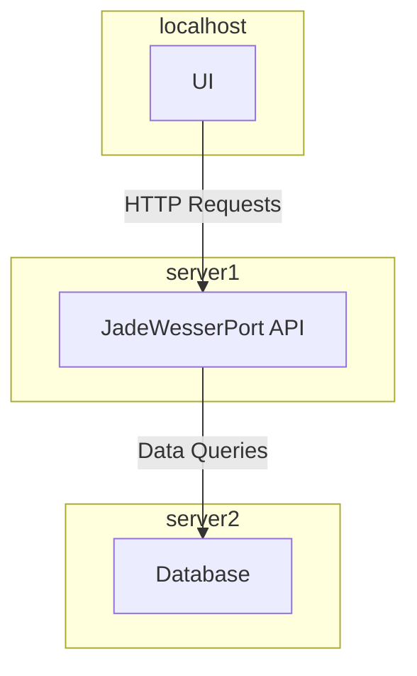

```mermaid

graph TB
%% === JADEWESSERPORT DEPLOYMENT ===
subgraph localhost["localhost"]
  UI["UI"]
end

subgraph server1["server1"]
  API["JadeWesserPort API"]
end

subgraph server2["server2"]
  DB["Database"]
end

UI -->|HTTP Requests| API
API -->|Data Queries| DB


```
