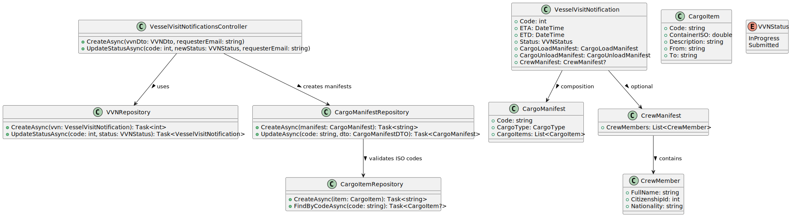

# US228 – Create and Submit Vessel Visit Notification

## 1. User Story Description
As a **Shipping Agent Representative**, I want to **create and submit a Vessel Visit Notification (VVN)** so that vessel berthing and subsequent loading/unloading operations are scheduled and planned in a timely and controlled manner.

**Acceptance Criteria:**
- The Cargo Manifest data for unloading and/or loading is included.
- The system must validate that container identifiers comply with the **ISO 6346:2022** standard.
- Crew information (name, citizen ID, nationality) might be requested for compliance with security protocols.
- Vessel Visit Notifications may remain in an **In Progress** state if cargo information is incomplete.
- When ready for review, the agent must change its state to **Submitted**.

---

## 2. System Overview
This functionality allows shipping agents to register new vessel visit notifications (VVNs) and manage their progress before submission.  
Each notification aggregates cargo manifests (load/unload) and optionally crew manifests for regulatory checks.  
When cargo or crew data is incomplete, the VVN remains “In Progress”; once all required data is filled, it transitions to “Submitted”.

---

## 3. Architecture

**Main Components:**
- **VesselVisitNotificationsController**
    - Handles creation and submission endpoints.
    - Updates VVN status between `InProgress` and `Submitted`.
- **VVNRepository**
    - Persists the Vessel Visit Notification and handles updates.
- **CargoManifestRepository** & **CargoItemRepository**
    - Manage cargo manifests and validate container identifiers.
- **CrewManifest** and **CrewMember**
    - Contain crew data for security and compliance.
- **Domain Entities**
    - Represent structured data for each manifest and related items.

---

## 4. UML – Class Diagram

